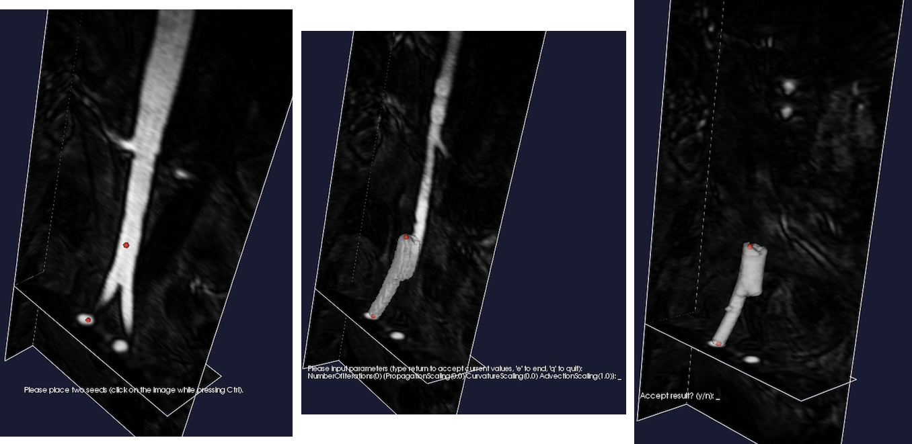
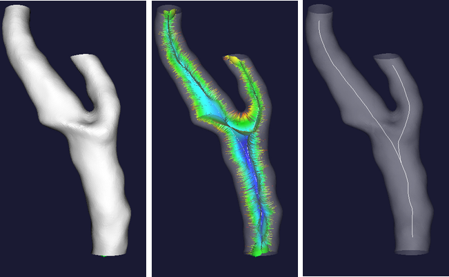
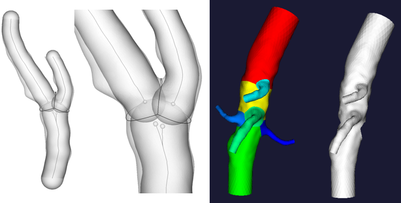
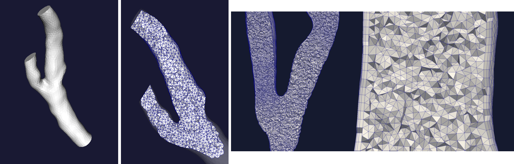
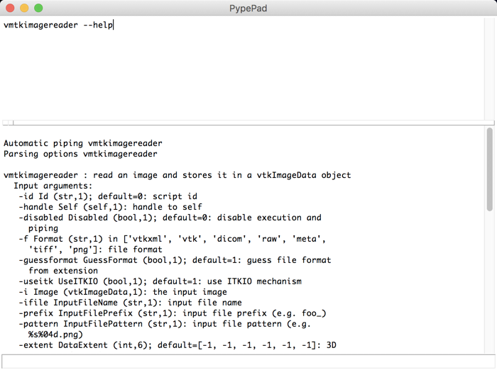

# Summary

Vascular disease is the leading cause of death in the developed world [@RN569].
There is a wide body of evidence demonstrating that the geometric structure and
layout of the vascular network has a major impact on hemodynamics and the
associated severity / progression of vascular diseases such as heart attack,
stroke, and aneurysm rupture [@RN478, @RN83].  Analysis of diagnostic medical
scans designed to highlight vascular structures (such as CT Angiography or MR
Angiography) allows for the detailed characterization of these structures *in
vivo*.  Such analyses generate quantitative measures which can be used in order
to understand both disease characteristics across a population, and the
efficacy of potential treatments [@RN550, @RN83].

``The Vascular Modeling Toolkit (VMTK)`` is a collection of python-wrapped C++
classes which enable the efficient segmentation, geometric characterization,
network analysis, hemodynamic modeling, and visualization of vascular
structures from medical images.  Image segmentation can be performed via a 3D
gradient based level set algorithm which is initialized from user defined
seeds. Surface editing, mesh generation, and geometric characterization is
largely automated, relying heavily on the centerline definitions calculated
from segmented structures.  User interaction is facilitated by a unique system
of unix-inspired ``pypes``.  This interface allows for the composable creation
and execution of entire analyses from simple terminal commands, providing a
flexible framework for high-level coding, both from the user’s and from the
developer’s point of view.

``VMTK`` is a mature package with an active development team and user
community.  It can be used via its standalone interface, included as a Python
or C++ library, or as an extension to the medical image processing platform 3D
Slicer [@Kikinis2014].  It has received over 400 citations in scientific
publications since its first release in 2004 [@RN83]. The library relies upon
two major open source frameworks for building highly performant and well
validated image analysis algorithms and visualizations: the Visualization
Toolkit (``VTK``) and the Insight Segmentation and Registration Toolkit
(``ITK``).  Thorough tutorials and documentation are available on the project
webpage: www.vmtk.org.

# VMTK In Action

## Generating a Surface from an Image via Level Set Evolution

Segmenting a complex vascular tract comes down to selecting the endpoints of a
branch, letting level sets by attracted to gradient peaks with the sole
advection term turned on, repeating the operation for all the branches and
merging everything in a single model.

``vmtklevelsetsegmentation -ifile foo.dcm --pipe vmtkmarchingcubes -i @.o
--pipe vmtksurfacewriter -ofile foo.vtp``

\

**Figure 1:** The process of placing seeds on an image (left). Initializing an isosurface from the seeds using the colliding fronts methods (center). Eolving the isosurface through the level set equations (right).

## Generating Centerlines from a Surface

Centerlines are determined as the paths defined on Voronoi diagram sheets that
minimize the integral of the radius of maximal inscribed spheres along the
path, which is equivalent to finding the shortest paths in the radius metric.

``vmtkcenterlines -ifile foo.vtp -ofile foo_centerlines.vtp``

\

**Figure 2:** The input surface representation (left). Visualization of the internal subset of the voronoi diagram where each sheet represents a maximum inscribed sphere radius centered at some point in the surface (center). The centerline extracted from the voronoi diagram rendered as in its position within the input surface (right).

## Splitting a Surface from its Centerlines

Surface properties can be analyzed, and the surface can be split by analyzing
the surface-centerline tube containment relationships.

``vmtksurfacereader -ifile foo.vtp --pipe vmtkcenterlines --pipe
vmtkbranchextractor --pipe vmtkbranchclipper -groupids 0 -insideout 1 -ofile
foo_sp.vtp``

\

**Figure 3:** Illustration of the centerline-surface tube containment relationships (left). Visualization of the surface being split into independent groups based on the surfaces membership in a centerline tract/group (right).

## Generating a Volumetric Mesh from a Surface

Tetrahedral, mixed tetrahedral, and boundary layer meshes can be generated from
a surface and its centerlines.

``vmtksurfacereader -ifile foo.vtp --pipe vmtkcenterlines --pipe
vmtkdistancetocenterlines -useradius 1 --pipe vmtkmeshgenerator
-elementsizemode edgelengtharray -edgelengtharray DistanceToCenterlines
-edgelengthfactor 0.3 -boundarylayer 1 -ofile foo.vtu``

\

**Figure 4:** The input surface representation (left). Visualization of the internal mesh (center). boundary layer generated within the internal mesh (right).

## Composable Scripting With Pypes

``Pypes`` is the glue among vmtk scripts. It allows new scripts to be written
easily and have a common interface, but, most of all, it allows single vmtk
scripts to interact with each other, making ``VMTK`` modular and flexible.
Pypes can be used from the command line, a python interpreter, or from the
custom ``PypePad`` user interface.

\

**Figure 5:** Pypepad user interface. vmtkimagereader specifies it's input file name with the -ifile flag, and the image is stored in memory as an output member of the script. vmtkmarchingcubes is initialized with this image as an input member, and the target isosurface level is set to 700 with the -l flag; the surface is generated and stored as an output member of the script. vmtksurfaceviewer is initialized with this surface as an input member, and the script displays the surface as an interactive rendering to the user in a new window.

# Acknowledgements & Funding

The Vascular Modeling Toolkit is a community project which is open-source and
free of charge. We would especially like to recognize significant
infrastructure contributions from the team at Kitware Inc. (www.kitware.com).
In addition we would like to acknowledge Orobix Srl. (www.orobix.com) for
partially funding continued development efforts of ``VMTK``.

In addition, we would like to that the following persons for their
contributions to the VMTK source code (Full Name followed by Github Username in
quotations): Andras Lassoan (lassoan), Jean-Christophe Fillion-Robin (jcfr),
Elena Faggiano (ElenaFagg), Kurt Sansom (kayarre), David Ladd (dladd), Steve
Pieper (pieper), Daniel Haehn (haehn), Denis Shamonin (dpshamonin), & Sara
Zanchi (SaraZanchi).

# References
